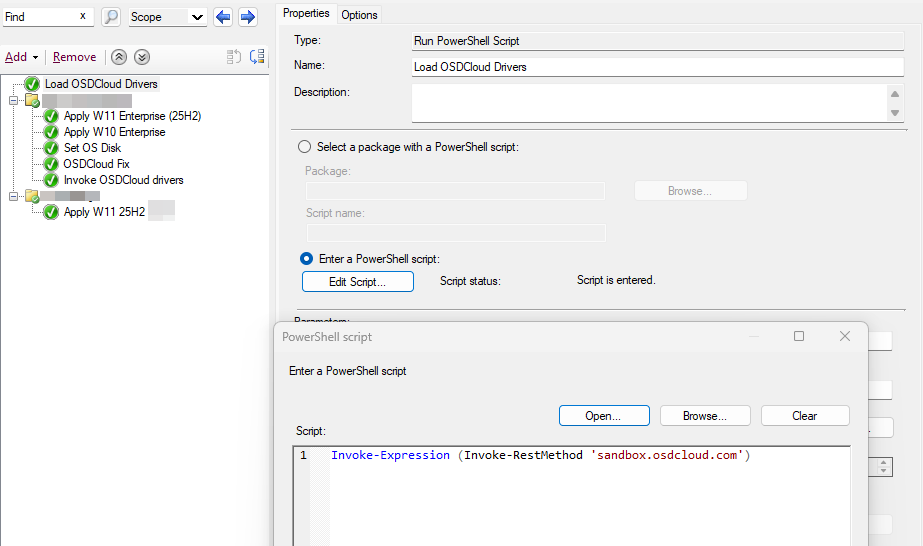
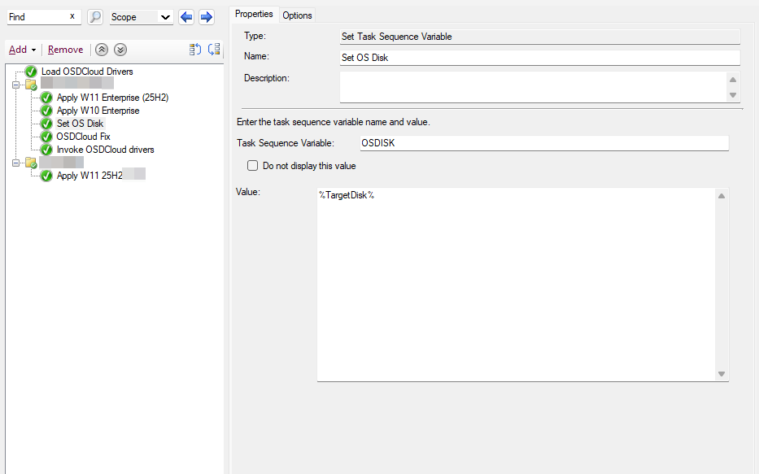
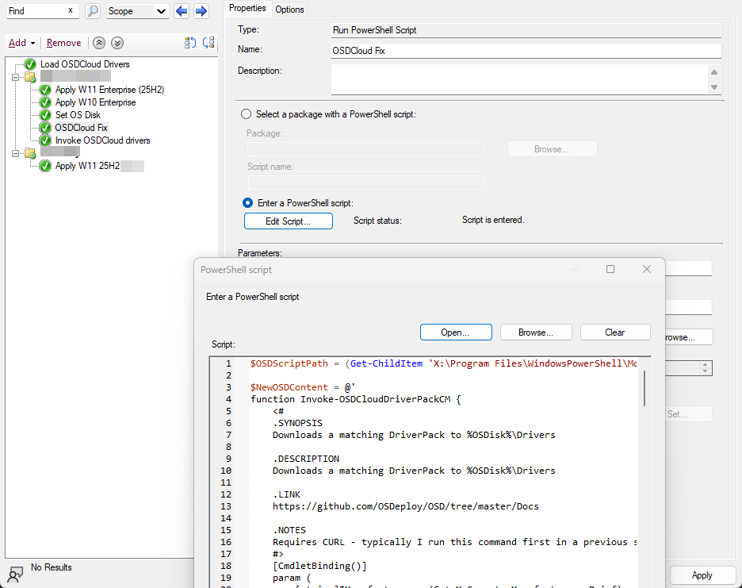
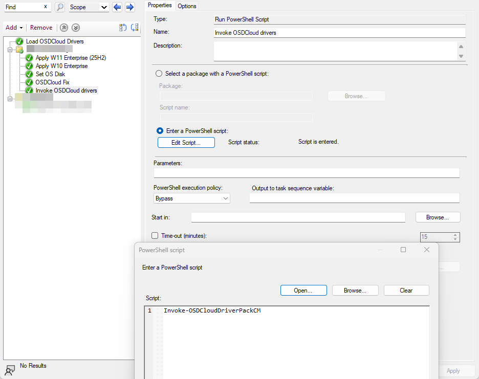

# OSDCloud Driver Injection via ConfigMgr Task Sequence

Replaces traditional driver management (like Driver Automation Tool) with real-time driver downloads during WinPE. Instead of maintaining terabytes of staged driver packs, this approach parses the vendor's catalog on the fly, downloads the correct driver pack for the hardware model, and injects it before the first reboot. so the OS comes up with working storage and network drivers out of the box.

This uses the [OSD PowerShell module](https://github.com/OSDeploy/OSD) (OSDCloud) and its `Invoke-OSDCloudDriverPackCM` function, with modifications to properly handle Dell and HP driver extraction and DISM injection during WinPE.

## Why Inject During WinPE?

When the OS image is applied and the machine reboots for the first time, the generic inbox drivers may not support the hardware's storage controller or NIC. If that happens, the machine can't boot or can't reach the network to continue the task sequence. Injecting drivers *before* the first reboot avoids this entirely.

Some driver packs can't be injected during WinPE and must be applied after the OS boots. For those, the script falls back to a provisioning package (PPKG) method that runs during the Specialize phase on first boot.

## How It Works

### Task Sequence Steps

The screenshots below show the relevant ConfigMgr task sequence structure:






### Step-by-Step Flow

**1. Load the OSD module into WinPE**

A "Run PowerShell Script" step executes:

```powershell
Invoke-Expression (Invoke-RestMethod 'sandbox.osdcloud.com')
```

This bootstraps the WinPE environment with the OSD module and installs curl (needed for driver downloads).

**2. Apply the operating system**

Apply your OS image as normal using your existing task sequence steps.

**3. Set the OS Disk variable (Optional)**

The OSDCloud module expects a task sequence variable called `OSDISK`. If your environment uses a different variable (e.g. `TargetDisk` from UI++), add a "Set Task Sequence Variable" step:

| Setting | Value |
|---------|-------|
| Variable | `OSDISK` |
| Value | `%TargetDisk%` |

**4. Apply the OSDCloud Fix (the important part)**

The original `Invoke-OSDCloudDriverPackCM` function doesn't properly handle Dell driver packs in WinPE. It was primarily developed around HP hardware. `OSDCloud-Modification.ps1` overwrites the function in memory with a version that adds:

- **Dell support**: Extracts Dell `.exe` driver packs using `/s /e=` and injects them with `dism.exe /Add-Driver /recurse`
- **HP support**: Extracts HP SoftPaq `.exe` packs using `/s /f` and injects with DISM
- **PPKG fallback**: If extraction fails (some packs don't support WinPE extraction), falls back to applying a provisioning package that installs drivers during the Specialize pass on first boot

The script works by locating the original `Invoke-OSDCloudDriverPackCM.ps1` in the OSD module directory and replacing its contents with the modified version before it runs.

**5. Invoke the driver pack download**

A final step runs:

```powershell
Invoke-OSDCloudDriverPackCM
```

This identifies the hardware model, finds a matching driver pack from the vendor catalog, downloads it via curl, extracts it, and injects the drivers into the offline OS image using DISM.

**6. Continue the task sequence**

The machine reboots into the OS with drivers already in place. So things like storage, network, and everything else the driver pack includes are baked into the OS.

## What the Modification Script Does

`OSDCloud-Modification.ps1` replaces the `Invoke-OSDCloudDriverPackCM` function with a modified version. The key changes from the original:

| Area | Original Behavior | Modified Behavior |
|------|-------------------|-------------------|
| Dell driver packs | Not extracted during WinPE | Extracted with `/s /e=` and injected via DISM |
| HP SoftPaqs | Handled via PPKG only | Extracted with `/s /f` and injected via DISM, PPKG as fallback |
| Other vendors | Handled via PPKG only | Unaffected
| Task Sequence progress | Minimal feedback | Progress bar updates at each stage (download, extract, inject) |
| Logging | Basic | Full transcript saved to `%OSDisk%\Windows\Debug\` |

## Files

| File | Description |
|------|-------------|
| `OSDCloud-Modification.ps1` | Overwrites `Invoke-OSDCloudDriverPackCM` in the OSD module with the modified version |

## Logs

- `%OSDisk%\Windows\Debug\*-Invoke-OSDCloudDriverPackCM.log` Timestamped transcript of the driver download and injection process

## Credits

- [OSDeploy / David Segura](https://github.com/OSDeploy/OSD) OSD PowerShell module and OSDCloud